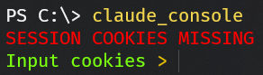
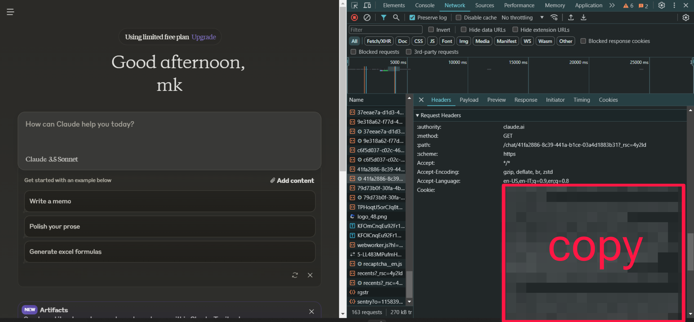
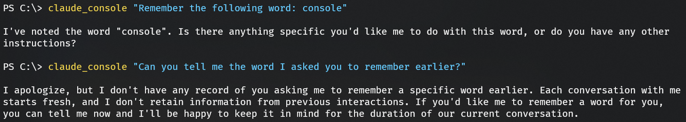
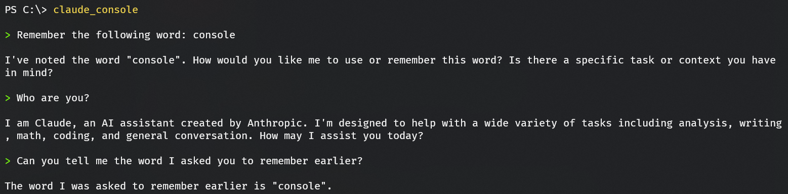

# Claude Console

Send prompts to [**Claude.ai**](https://claude.ai/) directly from your command line!

## 📝 Requirements

-   [Python 3](https://www.python.org/downloads/)
-   [Git](https://git-scm.com/downloads)

## ⚙️ Installation

Open a command line, navigate to a location where to store the files, then run the following commands:

```
git clone https://github.com/madkarmaa/claude-console.git
cd claude-console
pip install -r requirements.txt
```

> [!NOTE]
>
> The command (`claude_console`) installation is not required but recommended. You can run the installation script like so:
>
> ```
> python install.py
> ```

> [!CAUTION]
>
> Once installed, **DON'T** move the cloned folder or else it'll stop working.

## 💻 Usage

> [!IMPORTANT]
>
> **FIRST TIME RUN**
>
> The first time you'll run **Claude Console**, you'll be prompted with the following screen:
>
> 
>
> 1. Go to [claude.ai](https://claude.ai/chats/)
> 2. Open the browser's **Developer Tools window** by pressing `F12` or `Ctrl+Shift+i`
> 3. Go to the **Network tab**
> 4. Check for any request coming from `claude.ai` and open it
> 5. Scroll down to **Request Headers** and find the **Cookie parameter**
> 6. Copy the entire content of the parameter
> 7. Paste it in the Claude Console prompt
>
> 

**Claude Console** can be used in 2 ways:

### 📢 Single response

```
claude_console "<prompt>" <OPTIONS>
```

After the command is executed, the history of the response **cannot** be accessed by the AI anymore.

> [!TIP]
>
> **COMMAND LINE ARGUMENTS**
>
> Use `--open` (or `-o`, `--web`) to open the conversation in your default web browser.
> Use `--delete-all` (or `-da`) to delete all the conversations on your account.



### 🗨️ Full chat

```
claude_console
```

After the command is executed, an interactive command line chat is shown. The AI will remember the conversation, just like a normal chat.

> [!TIP]
>
> [Commands](#️-chat-commands) are available in chat mode!



## ✏️ Chat commands

### Command prefix: `!`

### exit

**Aliases**: `quit`, `q`, `exit`

Exits the program.

### open

**Aliases**: `web`, `open`, `o`

Continue the chat in your default web browser.

### copy

**Aliases**: `copy`, `cp`

Copy the previous response to the cliboard.
